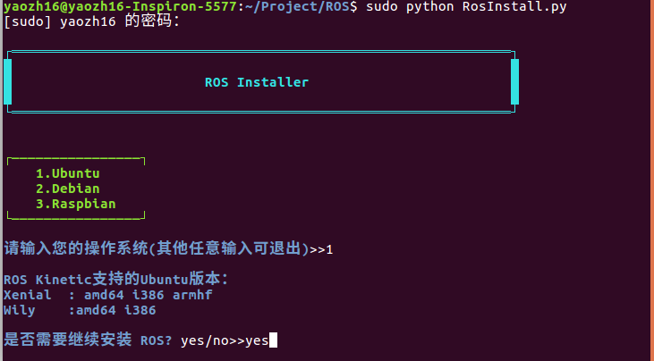

# 《地图构建》项目进展（2017秋季学期）

### **2017/8/27  明确任务**
- IMU.node在ROS中的自定义设置；
- 融合外部IMU和Laser数据，turtleBot作为移动平台，离线/在线建图；
- 拍摄Demo视频(走廊+两个房间)；
- 自建移动平台运动模型，整合前期成果，完成一套完整地图构建系统；
- 建立该项目的博客网站(GithubPage)；
- 从用户角度出发，简化系统搭建操作，将部分命令整合到后台(.exe，C++)；
- 编写用户使用手册。

### **2017/9/26 系统集成使用教程 by myc**
- 总结前期系统搭建流程和步骤，见`cartographer配置总结.docx`
- 详述.lauch和.lua文件的设置方法
- 但IMU的部分尚未完成，过程与Lidar相似

### **2017/9/29 用户程序安装  by yzh** 
- 完成ROS系统傻瓜式安装程序（如图）

- 按照类似的方法，继续Hokuyo和IMU的node的安装与配置

### **2017/10/25 在turtle上成功运行 by zl**
- 编写hukuyo.urdf.xacro，kuboki_hexagens_hokuyo.
- 配置文件修改 hokuyo_xsens.launch, turtlebot_xsens.lua, turtlebot_demo.rviz
- 总结文档完成，移步 https://zldodo.github.io/2017/11/09/07-SLAM-Summary/

### **2017/11/26 下阶段安排 by zl**
- 振翮继续完成软件封装的工作,调试.sh文件
- 封装硬件，制作一个SLAM硬件模块，包含Lidar,Imu和Raspi
- 针对该模块，修改之前的配置参数
- 完成新模块的调试工作，录制视频。
